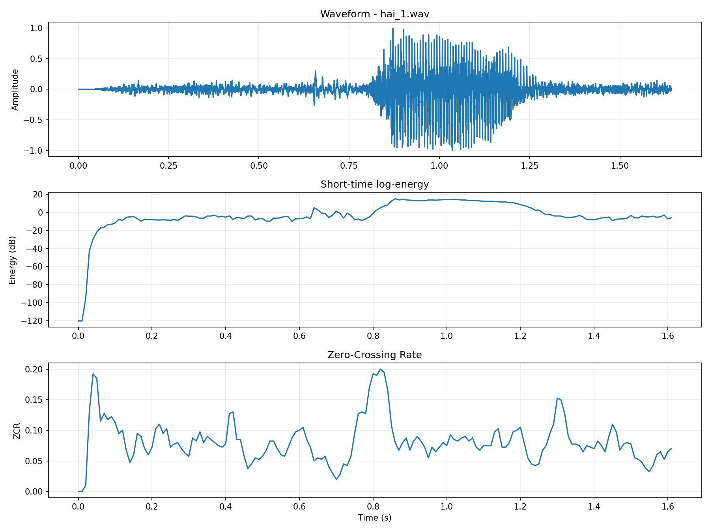
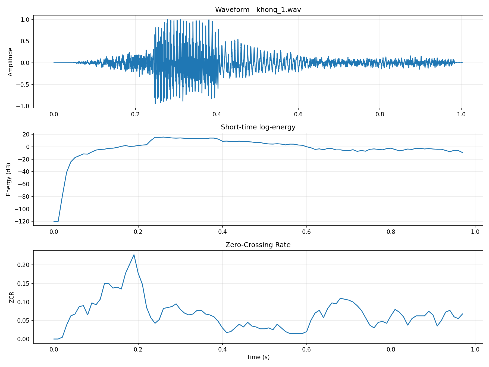
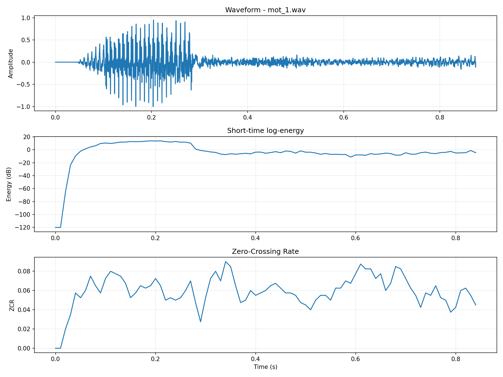
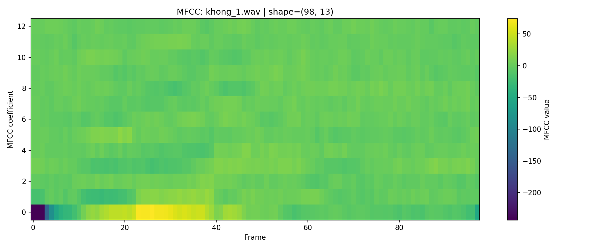
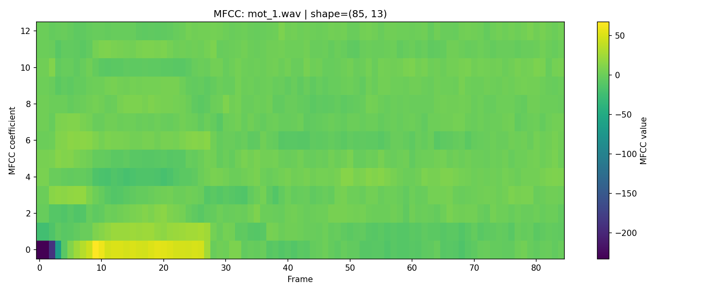
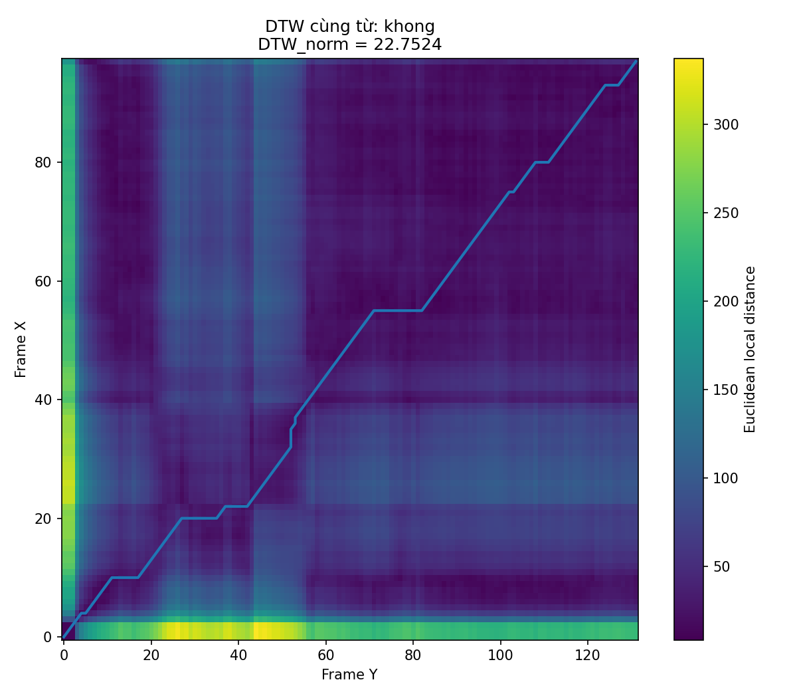
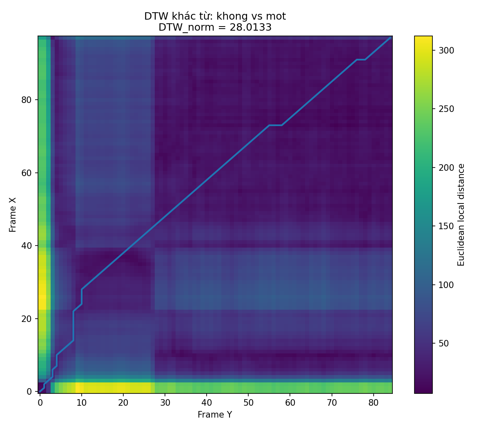
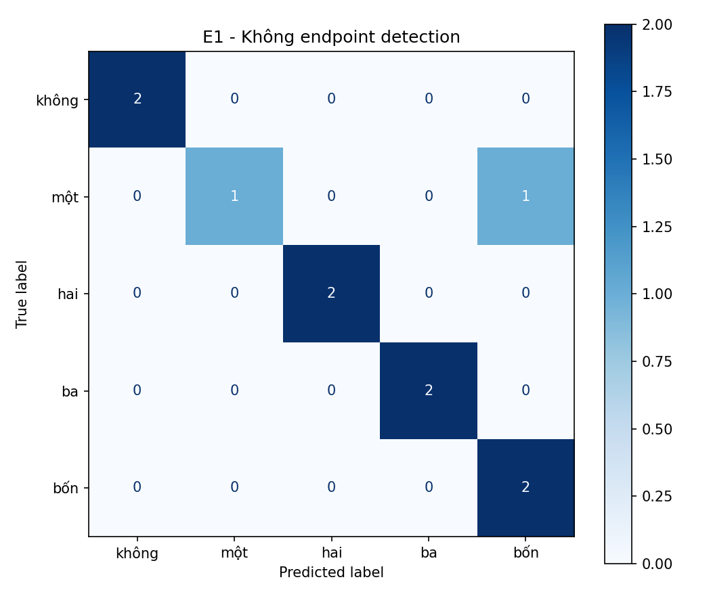
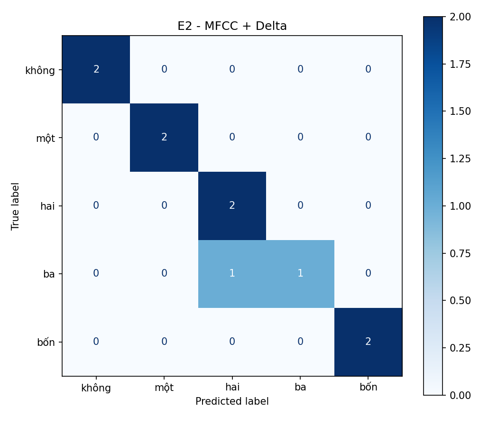
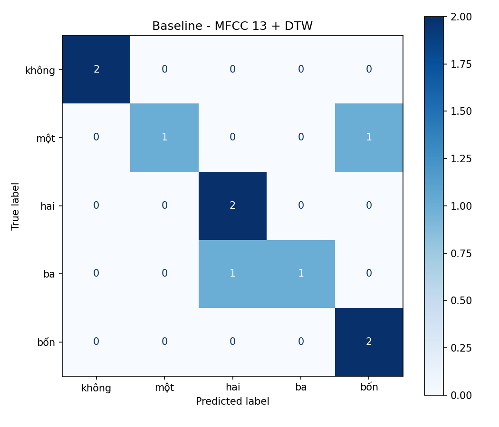

# CSE457 • XỬ LÝ ÂM THANH VÀ TIẾNG NÓI — LAB 2

> **Chủ đề:** Phân tích tín hiệu tiếng nói bằng Short-time Energy, Zero-Crossing Rate (ZCR), Endpoint Detection, MFCC, Dynamic Time Warping (DTW) và nhận dạng từ.
>
> **Mục tiêu:** biến tín hiệu waveform thành các đặc trưng có ý nghĩa hơn đối với tiếng nói, so sánh độ tương đồng giữa các utterance và đánh giá một bộ nhận dạng từ đơn giản.

---

## 1. Tổng quan quy trình

Pipeline của Lab 2 có thể tóm tắt như sau:

```text
Audio (.wav)
    │
    ▼
Waveform
    │
    ├──► Short-time Energy ──┐
    │                         ├──► Endpoint Detection
    └──► ZCR ─────────────────┘
                              │
                              ▼
                         Trim tiếng nói
                              │
                              ▼
                         MFCC 13 chiều
                              │
                ┌─────────────┴─────────────┐
                ▼                           ▼
              DTW                    Recognizer
                │                           │
                ▼                           ▼
        DTW cost + path             Accuracy + CM
```

### Các khái niệm chính

| Thành phần | Vai trò |
|---|---|
| **Waveform** | Biểu diễn biên độ tín hiệu theo thời gian |
| **Short-time Energy** | Đo mức năng lượng của từng đoạn ngắn |
| **ZCR** | Đo tốc độ tín hiệu đổi dấu |
| **Endpoint Detection** | Xác định phần bắt đầu/kết thúc của tiếng nói |
| **MFCC** | Biểu diễn đặc trưng phổ của tiếng nói theo thang Mel |
| **DTW** | Căn chỉnh hai chuỗi đặc trưng có tốc độ nói khác nhau |
| **Recognizer** | Dùng độ tương đồng để dự đoán từ |

---

# 2. Energy + ZCR

## 2.1. Lý thuyết Short-time Energy

Tín hiệu tiếng nói thay đổi rất nhanh theo thời gian, vì vậy không nên tính một giá trị năng lượng duy nhất cho toàn bộ file. Ta chia tín hiệu thành các **frame ngắn**.

Với frame thứ `m`, short-time energy có thể viết:

$$
E_m = \sum_{n=0}^{N-1} x_m[n]^2
$$

Trong đó:

- $x_m[n]$: mẫu tín hiệu thứ `n` trong frame `m`.
- $N$: số mẫu trong một frame.
- $E_m$: năng lượng của frame.

### Ý nghĩa

Bình phương $x_m[n]^2$ làm cho cả biên độ dương và âm đều đóng góp vào năng lượng.

- Biên độ lớn → năng lượng lớn.
- Biên độ nhỏ → năng lượng nhỏ.
- Silence → năng lượng rất thấp.

Trong thực tế, năng lượng thường được đưa về thang dB:

$$
E_{dB} = 10\log_{10}(E+\epsilon)
$$

với $\epsilon$ là số rất nhỏ để tránh $\log(0)$.

### Công thức này phục vụ gì?

Short-time Energy giúp **phát hiện khi nào có tiếng nói**.

Ví dụ:

```text
Silence       Speech                Silence
  thấp     ████████████████            thấp
Energy ────────╱████████████╲────────────
```

---

## 2.2. Zero-Crossing Rate

ZCR đo số lần tín hiệu đổi dấu trong một frame.

Một dạng công thức:

$$
ZCR_m =
\frac{1}{2(N-1)}
\sum_{n=1}^{N-1}
\left|
\operatorname{sgn}(x_m[n])
-
\operatorname{sgn}(x_m[n-1])
\right|
$$

Trong đó:

$$
\operatorname{sgn}(x)=
\begin{cases}
1 & x\ge 0\\
-1 & x<0
\end{cases}
$$

### Ý nghĩa

Nếu tín hiệu liên tục đổi:

```text
+  -  +  -  +  -  +  -
```

thì ZCR cao.

Nếu tín hiệu thay đổi chậm:

```text
+  +  +  +  -  -  -  -
```

thì ZCR thấp.

### ZCR phục vụ gì?

ZCR bổ sung thông tin mà Energy không cung cấp tốt:

- **Voiced speech:** thường năng lượng cao, ZCR thấp/trung bình.
- **Unvoiced speech:** thường năng lượng thấp hơn và ZCR cao hơn.
- **Silence:** Energy và ZCR đều thường rất thấp.

> **Lưu ý từ kết quả:** ba đồ thị Energy + ZCR hiện có thể hiện rõ vùng im lặng và vùng có tiếng nói. Tuy nhiên, các hình chưa tách riêng một vùng unvoiced đủ rõ để khẳng định bằng mắt rằng từng đoạn cụ thể là unvoiced.

---

## 2.3. Kết quả thực nghiệm

### Từ "hai"



**Nhận xét:**

- Ở đầu và cuối tín hiệu, waveform có biên độ nhỏ → tương ứng với năng lượng rất thấp.
- Khoảng khoảng `0.8–1.25 s` là vùng năng lượng cao rõ rệt → đây là vùng tiếng nói chính.
- ZCR tăng/giảm theo từng frame, cho thấy cấu trúc phổ của tiếng nói thay đổi theo thời gian.
- Vì vậy, Energy giúp xác định **có tiếng nói hay không**, còn ZCR giúp bổ sung thông tin về **tính chất của tín hiệu trong frame**.

### Từ "không"



**Nhận xét:**

- Năng lượng tăng mạnh từ khoảng `0.05 s`, đạt mức cao khoảng `0.25–0.4 s`.
- Sau đó năng lượng giảm dần.
- ZCR có một số đỉnh rõ ở khoảng `0.15–0.2 s`, cho thấy sự thay đổi mạnh của thành phần tần số.
- So với "hai", utterance "không" ngắn hơn và có phân bố năng lượng tập trung hơn.

### Từ "một"



**Nhận xét:**

- Năng lượng tăng nhanh từ khoảng `0.03 s`, đạt cực đại trong vùng `0.1–0.25 s`.
- Sau khoảng `0.3 s`, năng lượng giảm đáng kể và dao động quanh mức thấp.
- ZCR dao động quanh khoảng `0.04–0.09`, với một số đỉnh cục bộ.
- Điều này cho thấy phần mang thông tin tiếng nói tập trung chủ yếu ở nửa đầu utterance.

---

# 3. Endpoint Detection

## 3.1. Endpoint detection là gì?

Endpoint Detection nhằm tìm:

- **Start point:** thời điểm tiếng nói bắt đầu.
- **End point:** thời điểm tiếng nói kết thúc.

Sau đó ta có thể loại bỏ silence:

```text
Audio gốc
[ Silence ][      Speech       ][ Silence ]

                 │
                 ▼

Audio sau trim
          [      Speech       ]
```

### Tại sao phải trim?

Nếu giữ quá nhiều silence:

- DTW phải căn chỉnh những phần không mang thông tin.
- MFCC có thể chứa nhiều frame không cần thiết.
- Recognizer dễ bị ảnh hưởng bởi độ dài và phần nền.
- Chi phí so khớp có thể tăng.

---

## 3.2. Endpoint dựa trên Energy + ZCR

Một cách đơn giản là dùng ngưỡng:

$$
E_m > T_E
$$

và/hoặc điều kiện liên quan đến:

$$
ZCR_m > T_Z
$$

Trong đó:

- $T_E$: ngưỡng năng lượng.
- $T_Z$: ngưỡng ZCR.

### Ý nghĩa

Energy trả lời:

> "Frame này có đủ năng lượng để được xem là tiếng nói không?"

ZCR trả lời:

> "Frame này có đặc điểm đổi dấu như thế nào?"

Kết hợp hai đặc trưng giúp endpoint detection ổn định hơn so với chỉ dùng một đặc trưng.

---

## 3.3. Nhận xét về kết quả trim

Các confusion matrix cho thấy hai chế độ:

- **Không endpoint detection**
- **Có endpoint detection**

đều đạt kết quả tốt trên tập mẫu nhỏ.

Tuy nhiên, lỗi dự đoán thay đổi:

- Không trim: từ **"một"** có 1 mẫu bị nhận thành **"bốn"**.
- Có trim: từ **"ba"** có 1 mẫu bị nhận thành **"hai"**.

Điều này cho thấy trimming không chỉ làm thay đổi độ dài tín hiệu mà còn làm thay đổi chuỗi đặc trưng được đưa vào recognizer.

> **Giới hạn của bộ hình:** các hình được cung cấp không ghi trực tiếp `duration_before` và `duration_after`, nên không nên tự suy ra một con số thời lượng trước/sau trim. Muốn báo cáo chính xác phần này cần lấy hai giá trị duration từ output của chương trình endpoint detection.

---

# 4. MFCC

## 4.1. MFCC là gì?

MFCC — **Mel-Frequency Cepstral Coefficients** — là một trong những đặc trưng kinh điển của xử lý tiếng nói.

Mục tiêu là biến waveform:

$$
x[n]
$$

thành một ma trận đặc trưng:

$$
\mathbf{C}\in\mathbb{R}^{T\times K}
$$

Trong đó:

- $T$: số frame theo thời gian.
- $K$: số MFCC giữ lại.
- Trong thí nghiệm này: **13 MFCC**.

---

## 4.2. Các bước tính MFCC

```text
Waveform
   │
   ▼
Pre-emphasis
   │
   ▼
Framing + Windowing
   │
   ▼
FFT
   │
   ▼
Power Spectrum
   │
   ▼
Mel Filterbank
   │
   ▼
Log
   │
   ▼
DCT
   │
   ▼
MFCC
```

---

## 4.3. Mel scale

Tai người không cảm nhận tần số theo tuyến tính.

Một công thức Mel thường dùng:

$$
m = 2595\log_{10}
\left(1+\frac{f}{700}\right)
$$

Trong đó:

- $f$: tần số Hz.
- $m$: tần số trên thang Mel.

Khi chuyển từ Hz sang Mel, khoảng cách tần số cao bị nén lại.

### Vì sao Mel filterbank có khoảng cách theo Hz rộng dần khi tần số tăng?

Các điểm filter được đặt **đều nhau trên thang Mel**, không phải đều nhau trên Hz.

Do quan hệ phi tuyến giữa Mel và Hz:

$$
m = 2595\log_{10}(1+f/700)
$$

nên khi quay ngược từ Mel về Hz, khoảng cách giữa các điểm trên Hz tăng dần khi tần số tăng.

### Ý nghĩa

Điều này giúp MFCC:

- có độ phân giải tốt hơn ở vùng tần số thấp;
- giảm độ phân giải ở vùng tần số cao;
- gần hơn với cách tai người cảm nhận âm thanh.

---

## 4.4. Log trong MFCC

Sau Mel filterbank ta có năng lượng:

$$
M_k
$$

Ta lấy log:

$$
L_k = \log(M_k+\epsilon)
$$

### Log dùng để làm gì?

Âm thanh có dynamic range rất lớn.

Ví dụ:

```text
Năng lượng:
10
100
1,000
10,000
100,000
```

Sau log, khoảng cách được nén:

```text
log(10)
log(100)
log(1,000)
...
```

Vì vậy log giúp:

1. **Nén dynamic range**.
2. Giảm sự chênh lệch quá lớn giữa năng lượng mạnh và yếu.
3. Làm đặc trưng phù hợp hơn với cảm nhận âm lượng của con người.

---

## 4.5. DCT tạo ra MFCC như thế nào?

Từ `M` log-energy của Mel filterbank, DCT tạo ra các cepstral coefficients:

$$
c_n =
\sum_{k=1}^{M}
L_k
\cos
\left[
\frac{\pi n}{M}
\left(k-\frac{1}{2}\right)
\right]
$$

Trong đó:

- $L_k$: log-energy của Mel filter thứ `k`.
- $M$: số Mel filter.
- $c_n$: MFCC thứ `n`.

### DCT biến M log-energy thành gì?

DCT biến vector **log-energy theo các Mel filter** thành các hệ số cepstral.

Có thể hiểu đơn giản:

```text
Mel log-energy
[ L1 L2 L3 ... LM ]
          │
          ▼ DCT
[ c0 c1 c2 ... ]
          │
          ▼
      MFCC 13
```

Các hệ số đầu mô tả xu hướng phổ tổng thể, còn các hệ số cao hơn mô tả những biến thiên chi tiết hơn của spectral envelope.

---

# 5. MFCC Heatmap

## 5.1. Từ "không"



Shape:

```text
(98, 13)
```

Điều này có nghĩa:

- 98 frame theo thời gian.
- Mỗi frame có 13 MFCC.

### Nhận xét

- MFCC thay đổi theo trục thời gian → đặc trưng tiếng nói không cố định trong toàn bộ utterance.
- MFCC 0 có giá trị biến thiên mạnh hơn một số hệ số cao.
- Có các vùng thay đổi rõ ở phần đầu và giữa chuỗi.
- Điều này phản ánh các âm vị/thành phần phổ khác nhau trong từ "không".

---

## 5.2. Từ "một"



Shape:

```text
(85, 13)
```

### Nhận xét

- "một" có 85 frame, ngắn hơn "không" với 98 frame.
- Cấu trúc MFCC tập trung nhiều biến thiên ở phần đầu.
- Sau khoảng frame 25–30, một số hệ số ổn định hơn.
- Vì số frame khác nhau nên không thể so sánh hai utterance chỉ bằng khoảng cách Euclidean từng frame một.

Đây chính là lý do DTW cần thiết.

---

# 6. DTW — Dynamic Time Warping

## 6.1. Tại sao cần DTW?

Giả sử cùng nói một từ:

```text
Người A:  ─────────────
Người B:  ────────────────────
```

Nội dung giống nhau nhưng tốc độ nói khác nhau.

Nếu so sánh frame `1` với frame `1`, frame `2` với frame `2`, ... thì hai chuỗi có thể không khớp.

DTW cho phép **co giãn trục thời gian** để tìm cách căn chỉnh tốt nhất.

---

## 6.2. Ma trận cost

Giả sử:

- Chuỗi X có `N` frame.
- Chuỗi Y có `M` frame.

Khoảng cách giữa hai frame:

$$
d(i,j)=
\|\mathbf{x}_i-\mathbf{y}_j\|_2
$$

Trong đó $\mathbf{x}_i$ và $\mathbf{y}_j$ là vector MFCC.

DTW dùng quy hoạch động:

$$
D(i,j)=d(i,j)+
\min
\begin{cases}
D(i-1,j)\\
D(i,j-1)\\
D(i-1,j-1)
\end{cases}
$$

---

## 6.3. Ý nghĩa ba bước trong ma trận DTW

### Bước chéo

$$
(i-1,j-1)\rightarrow(i,j)
$$

Ý nghĩa:

> Hai frame tiếp theo được căn chỉnh gần như cùng tốc độ thời gian.

### Bước ngang

$$
(i,j-1)\rightarrow(i,j)
$$

Ý nghĩa:

> Một frame của chuỗi Y được ghép với nhiều frame liên tiếp của chuỗi X.

Điều này biểu diễn một bên đang "kéo dài" tại vùng đó.

### Bước dọc

$$
(i-1,j)\rightarrow(i,j)
$$

Ý nghĩa:

> Một frame của chuỗi X được ghép với nhiều frame của chuỗi Y.

Đây là dạng co giãn thời gian theo hướng ngược lại.

---

# 7. DTW — cùng từ



Kết quả:

$$
DTW_{norm}=22.7524
$$

### Nhận xét

- Path bắt đầu gần góc dưới trái và kết thúc gần góc trên phải.
- Đường đi nhìn chung bám theo đường chéo.
- Có một số đoạn nằm ngang hoặc dọc, thể hiện hai utterance có tốc độ phát âm khác nhau ở một số vùng.
- Cost chuẩn hóa tương đối thấp hơn trường hợp hai từ khác nhau.

### Ý nghĩa

Nếu hai utterance là **cùng một từ**, các vùng MFCC tương ứng có xu hướng giống nhau hơn nên DTW có thể tìm được một path có chi phí thấp.

---

# 8. DTW — khác từ



Kết quả:

$$
DTW_{norm}=28.0133
$$

So với cùng từ:

$$
\Delta =
28.0133-22.7524
=
5.2609
$$

Phần trăm tăng:

$$
\frac{28.0133-22.7524}{22.7524}\times100
\approx23.12\%
$$

### Nhận xét

- DTW cost của hai từ khác nhau cao hơn.
- Path vẫn đi từ góc dưới trái tới góc trên phải và có xu hướng gần đường chéo vì độ dài hai chuỗi không quá khác nhau.
- Tuy nhiên, các vùng đặc trưng MFCC không tương đồng hoàn toàn nên tổng chi phí tăng.

### Kết luận

Trong thí nghiệm:

> **Cùng từ:** `22.7524`  
> **Khác từ:** `28.0133`

Do đó DTW có khả năng phân biệt hai chuỗi dựa trên mức độ tương đồng của đặc trưng theo thời gian.

---

# 9. Recognizer

## 9.1. Confusion matrix

Confusion matrix cho biết:

- Hàng = **True label**.
- Cột = **Predicted label**.
- Đường chéo chính = dự đoán đúng.
- Ngoài đường chéo = lỗi nhận dạng.

Accuracy:

$$
Accuracy=
\frac{\text{Số dự đoán đúng}}
{\text{Tổng số mẫu}}
$$

---

## 9.2. E1 — Không endpoint detection



Tổng số mẫu:

$$
10
$$

Số mẫu đúng:

$$
2+1+2+2+2=9
$$

Accuracy:

$$
Accuracy=\frac{9}{10}=90\%
$$

### Nhận xét bắt buộc

- Hầu hết các từ được nhận dạng đúng.
- Lỗi nổi bật là **"một" → "bốn"**.
- Điều này cho thấy khi chưa loại bỏ silence, một số đặc trưng đầu/cuối có thể làm thay đổi độ tương đồng DTW.

---

## 9.3. E1 — Có endpoint detection


Số mẫu đúng:

$$
2+1+2+2+2=9
$$

Accuracy:

$$
90\%
$$

### Nhận xét bắt buộc

- Accuracy không thay đổi trên tập mẫu nhỏ.
- Tuy nhiên loại lỗi đã thay đổi.
- **"ba" → "hai"** xuất hiện 1 lần.
- Vì vậy endpoint detection có ảnh hưởng đến chuỗi đặc trưng, dù trong thí nghiệm nhỏ này chưa làm Accuracy tăng.

---

# 10. E2 — MFCC 13


Accuracy:

$$
Accuracy=\frac{9}{10}=90\%
$$

### Nhận xét bắt buộc

- MFCC 13 cung cấp biểu diễn phổ gọn hơn waveform.
- Hai từ **"một"** và **"bốn"** vẫn có một trường hợp nhầm lẫn.
- Điều này cho thấy chỉ dùng MFCC 13 chưa chắc mô tả đầy đủ mọi khác biệt theo thời gian giữa các từ.

---

# 11. E2 — MFCC + Delta



Accuracy:

$$
Accuracy=\frac{9}{10}=90\%
$$

### Delta là gì?

Nếu MFCC mô tả đặc trưng phổ tại một thời điểm, Delta mô tả **tốc độ thay đổi của đặc trưng đó theo thời gian**.

Một dạng xấp xỉ:

$$
\Delta_t
\approx
\frac{
\sum_{n=1}^{N}
n(c_{t+n}-c_{t-n})
}{
2\sum_{n=1}^{N}n^2
}
$$

### Nhận xét

- Thêm Delta giúp đưa thông tin động học vào đặc trưng.
- Ma trận cho thấy **"ba" → "hai"** vẫn là lỗi đáng chú ý.
- Trên tập chỉ có 10 mẫu, Accuracy vẫn là 90%, vì vậy chưa thể kết luận Delta luôn tốt hơn MFCC 13 chỉ từ kết quả này.

---

# 12. Baseline — MFCC 13 + DTW



Accuracy:

$$
Accuracy=\frac{9}{10}=90\%
$$

### Nhận xét

Baseline cho thấy pipeline:

```text
MFCC 13
   +
DTW
   ↓
Nearest template
   ↓
Predicted word
```

đã nhận dạng đúng 9/10 mẫu trong tập thử nghiệm được thể hiện.

Lỗi còn lại là:

> **"ba" → "hai"**

Đây là cặp cần phân tích thêm bằng waveform, MFCC và DTW path.

---

# 13. Phân tích cặp từ dễ nhầm

## 13.1. Cặp nổi bật

Từ các confusion matrix:

- Không trim / MFCC 13: **"một" ↔ "bốn"** là lỗi đáng chú ý.
- Trim / MFCC + Delta / Baseline: **"ba" → "hai"** xuất hiện.

Đối với **baseline cuối cùng**, cặp dễ nhầm nhất là:

> **"ba" và "hai"**

vì một mẫu "ba" bị nhận thành "hai", trong khi mỗi lớp chỉ có 2 mẫu trong ma trận.

## 13.2. Phân tích nguyên nhân

Có thể xem xét ba yếu tố:

### Waveform

Các từ nói ra có thể có:

- biên độ khác nhau;
- tốc độ phát âm khác nhau;
- khoảng silence khác nhau;
- vị trí bắt đầu/kết thúc khác nhau.

### MFCC

MFCC của hai từ có thể có các vùng spectral envelope gần nhau ở một số frame.

Khi DTW tìm path, nó có thể tìm được một đường căn chỉnh với chi phí tương đối thấp dù hai từ khác nhau.

### DTW path

DTW cho phép path lệch khỏi đường chéo.

Nếu một vùng của từ "ba" có tốc độ hoặc cấu trúc phổ gần một vùng của "hai", DTW có thể kéo/giãn vùng đó để giảm tổng cost.

### Kết luận

Không nên xem một lỗi nhận dạng đơn lẻ là bằng chứng rằng hai từ hoàn toàn giống nhau. Tập thử nghiệm hiện tại rất nhỏ, nên cần thêm nhiều utterance để xác định nguyên nhân ổn định.

---

# 14. Câu hỏi lý thuyết

## Câu 1. Vì sao không nên dùng toàn bộ waveform làm template chính khi hai utterance có thời lượng khác nhau?

Waveform phụ thuộc trực tiếp vào thời gian.

Ví dụ:

```text
Utterance A:  |--a--|--b--|--c--|
Utterance B:  |----a----|--b--|--c--|
```

Hai người có thể phát âm cùng một từ nhưng:

- tốc độ khác nhau;
- kéo dài nguyên âm khác nhau;
- thời điểm bắt đầu/kết thúc khác nhau.

Nếu so sánh trực tiếp waveform:

$$
d(x_i,y_i)=|x_i-y_i|
$$

thì các frame tương ứng về chỉ số chưa chắc tương ứng về nội dung.

DTW giải quyết vấn đề bằng cách tìm ánh xạ:

$$
(i,j)
$$

thay vì bắt buộc:

$$
i=j
$$

**Vì vậy waveform không phải template tốt khi thời lượng thay đổi mạnh.**

---

## Câu 2. Vai trò khác nhau của Energy và ZCR trong endpoint detection?

### Energy

Đo mức năng lượng:

$$
E_m=\sum_n x_m[n]^2
$$

→ rất hữu ích để phân biệt:

```text
Silence ↔ Speech
```

### ZCR

Đo tốc độ đổi dấu:

$$
ZCR_m\propto
\sum_n
|\operatorname{sgn}(x[n])-\operatorname{sgn}(x[n-1])|
$$

→ bổ sung thông tin về tính chất của tín hiệu, đặc biệt hữu ích khi tín hiệu có năng lượng thấp nhưng chứa thành phần tần số cao.

**Tóm lại:**

> Energy mạnh về "có tiếng hay không"; ZCR bổ sung "tiếng đó có đặc tính phổ/tần số như thế nào".

---

## Câu 3. Vì sao Mel filterbank có khoảng cách theo Hz rộng dần khi tần số tăng?

Vì các filter được đặt gần đều trên **Mel scale**:

$$
m=2595\log_{10}(1+f/700)
$$

Mel scale có độ phân giải cao hơn ở tần số thấp và thấp hơn ở tần số cao.

Khi chuyển các điểm Mel ngược về Hz, khoảng cách Hz tăng dần.

Điều này phản ánh gần đúng cách tai người phân biệt cao độ/tần số.

---

## Câu 4. Log trong MFCC có tác dụng gì? DCT biến M log-energy thành gì?

### Log

$$
L_k=\log(M_k+\epsilon)
$$

giúp:

- nén dynamic range;
- giảm ảnh hưởng của năng lượng quá lớn;
- làm phân bố năng lượng dễ xử lý hơn.

### DCT

$$
c_n =
\sum_{k=1}^{M}
L_k
\cos
\left[
\frac{\pi n}{M}
(k-\frac12)
\right]
$$

biến `M` log-energy của các Mel filter thành các **cepstral coefficients**.

Sau đó ta thường giữ một số hệ số đầu, ví dụ:

```text
MFCC 1 ... MFCC 13
```

để có vector đặc trưng gọn hơn.

---

## Câu 5. Trong ma trận DTW, ý nghĩa của bước ngang, dọc và chéo?

| Bước | Từ | Ý nghĩa |
|---|---|---|
| **Ngang** | `(i,j-1) → (i,j)` | Một frame của chuỗi này được ghép với nhiều frame của chuỗi kia |
| **Dọc** | `(i-1,j) → (i,j)` | Tương tự nhưng theo hướng ngược lại |
| **Chéo** | `(i-1,j-1) → (i,j)` | Hai chuỗi tiến cùng nhau theo thời gian |

Bước ngang/dọc tạo khả năng **time warping**, còn bước chéo biểu diễn sự đồng bộ gần như 1–1.

---

## Câu 6. Tại sao phải chuẩn hóa DTW cost theo path length?

Nếu chỉ dùng tổng cost:

$$
DTW=\sum_{(i,j)\in P}d(i,j)
$$

thì chuỗi dài hơn thường có nhiều điểm hơn và dễ có tổng cost lớn hơn.

Do đó khi so sánh utterance có độ dài khác nhau, ta dùng:

$$
DTW_{norm}
=
\frac{DTW}{|P|}
$$

Trong đó:

- $P$: DTW path.
- $|P|$: số bước/điểm trên path.

### Ý nghĩa

DTW_norm gần với:

> **chi phí trung bình trên một bước căn chỉnh**

Nhờ đó so sánh công bằng hơn giữa các utterance có độ dài khác nhau.

---

## Câu 7. Ít nhất ba nguyên nhân làm cùng một từ có MFCC khác nhau giữa hai lần nói

Có thể có nhiều nguyên nhân:

1. **Tốc độ nói khác nhau**  
   → số frame và vị trí đặc trưng thay đổi.

2. **Cao độ người nói khác nhau**  
   → cấu trúc phổ thay đổi.

3. **Biên độ/âm lượng khác nhau**  
   → năng lượng và một số đặc trưng thay đổi.

4. **Cách phát âm khác nhau**  
   → vị trí môi, lưỡi và cách tạo âm khác nhau.

5. **Nhiễu môi trường**  
   → làm thay đổi phổ tín hiệu.

6. **Micro/khoảng cách tới microphone khác nhau**  
   → đáp ứng tần số và năng lượng thay đổi.

Vì vậy MFCC của hai lần nói cùng một từ **không cần giống hệt nhau**.

---

# 15. Câu 8 — Phân tích cặp dễ nhầm nhất

Đối với baseline:

> **"ba" → "hai"**

Ta có thể phân tích theo pipeline:

```text
Waveform
   │
   ▼
Endpoint
   │
   ▼
MFCC
   │
   ▼
DTW
   │
   ▼
Distance
   │
   ▼
Nearest template
   │
   ▼
"hai"
```

### Waveform

Cần kiểm tra xem hai từ có:

- cùng mức năng lượng hay không;
- cùng độ dài hay không;
- có silence đầu/cuối hay không.

### MFCC

Nếu hai từ có các vùng MFCC gần nhau, Euclidean distance giữa các frame tương ứng sẽ nhỏ hơn.

### DTW path

Nếu path có nhiều bước ngang/dọc, điều đó cho thấy cần time warping đáng kể để căn chỉnh.

### Nguyên nhân khả dĩ

Lỗi có thể đến từ:

- tập dữ liệu quá nhỏ;
- template chưa đại diện đủ cho biến thiên phát âm;
- hai từ có một số vùng spectral tương đồng;
- tốc độ nói khác nhau;
- endpoint hoặc nhiễu làm thay đổi MFCC.

> **Không nên kết luận chắc chắn chỉ từ một confusion matrix 10 mẫu.** Cần thêm nhiều utterance và phân tích từng cặp template để xác nhận.

---

# 16. Câu 9 — Hạn chế của DTW khi gặp người nói mới

Nếu hệ thống dùng template:

```text
Template "một" → người A
Template "hai" → người A
Template "ba"   → người A
...
```

thì khi xuất hiện người B:

```text
Speech người B
       │
       ▼
DTW với template người A
```

DTW vẫn có thể hoạt động, nhưng template không đại diện tốt cho biến thiên của người B.

### Hạn chế

- Phụ thuộc template.
- Tốn chi phí so sánh với nhiều template.
- Không học được đặc trưng tổng quát của nhiều người nói.
- Khả năng generalization kém khi speaker mới có giọng khác.

### Nội dung Chương 3 giải quyết tốt hơn

Nếu Chương 3 chuyển sang các phương pháp **học mô hình/đặc trưng từ dữ liệu**, thì đó là hướng phù hợp hơn vì hệ thống có thể học đặc trưng tổng quát thay vì chỉ nhớ template của một người.

Ví dụ về tư tưởng:

```text
Nhiều speaker
     │
     ▼
Học đặc trưng chung
     │
     ▼
Mô hình nhận dạng
     │
     ▼
Speaker mới
```

Điểm quan trọng:

> DTW là phương pháp **căn chỉnh + so khớp template**, không phải một mô hình học biểu diễn speaker-invariant.

---

# 17. Tổng hợp kết quả thực nghiệm

| Thí nghiệm | Kết quả | Nhận xét |
|---|---:|---|
| Energy + ZCR | 3 utterance | Phân biệt rõ vùng silence và speech |
| Endpoint | Có/không trim | Accuracy trên tập mẫu nhỏ không đổi, nhưng lỗi nhận dạng thay đổi |
| MFCC "không" | `(98, 13)` | 98 frame, 13 hệ số |
| MFCC "một" | `(85, 13)` | 85 frame, 13 hệ số |
| DTW cùng từ | **22.7524** | Cost thấp hơn, path nhìn chung gần đường chéo |
| DTW khác từ | **28.0133** | Cost cao hơn khoảng **23.12%** |
| E1 — không trim | **90%** | "một" → "bốn" là lỗi nổi bật |
| E1 — trim | **90%** | "ba" → "hai" là lỗi nổi bật |
| E2 — MFCC 13 | **90%** | "một" → "bốn" xuất hiện |
| E2 — MFCC + Delta | **90%** | "ba" → "hai" xuất hiện |
| Baseline — MFCC 13 + DTW | **90%** | "ba" → "hai" là lỗi còn lại |

---

# 18. Kết luận

Qua Lab 2 có thể thấy một pipeline nhận dạng từ đơn giản không chỉ dựa vào waveform.

Ta chuyển dần:

$$
Waveform
\rightarrow
Energy/ZCR
\rightarrow
Endpoint
\rightarrow
MFCC
\rightarrow
DTW
\rightarrow
Recognizer
$$

Mỗi bước giải quyết một vấn đề:

- **Energy:** phát hiện mức năng lượng của tiếng nói.
- **ZCR:** bổ sung thông tin về đổi dấu/tính chất tần số.
- **Endpoint:** loại bỏ phần silence không cần thiết.
- **MFCC:** biến waveform thành biểu diễn đặc trưng phổ phù hợp hơn cho tiếng nói.
- **DTW:** xử lý khác biệt về tốc độ phát âm và thời lượng.
- **Recognizer:** dùng khoảng cách để quyết định từ.

Kết quả DTW cho thấy:

$$
DTW_{same}=22.7524
$$

nhỏ hơn:

$$
DTW_{different}=28.0133
$$

và confusion matrix cho thấy baseline đạt:

$$
\boxed{Accuracy=90\%}
$$

trên tập mẫu được thể hiện.

Tuy nhiên, vì số lượng mẫu trong confusion matrix chỉ là **10**, kết quả 90% chưa đủ để đánh giá khả năng tổng quát của hệ thống. Một thí nghiệm hoàn chỉnh nên tăng số lượng utterance, số speaker và điều kiện ghi âm.

---

# 19. Cấu trúc thư mục đề xuất khi upload GitHub

```text
Lab2/
│
├── README.md
│
└── assets/
    ├── 02_energy_zcr_hai.png
    ├── 02_energy_zcr_khong.png
    ├── 02_energy_zcr_mot.png
    ├── 03_mfcc_khong.png
    ├── 03_mfcc_mot.png
    ├── 04_dtw_same_word.png
    ├── 05_dtw_different_word.png
    ├── 06_confusion_no_trim.png
    ├── 07_confusion_trim.png
    ├── 08_confusion_mfcc13.png
    ├── 09_confusion_mfcc_delta.png
    └── 10_confusion_baseline.png
```

GitHub sẽ tự render các hình trong README thông qua đường dẫn:

```markdown

```

---

## 20. Tóm tắt công thức quan trọng

### Short-time Energy

$$
E_m=\sum_{n=0}^{N-1}x_m[n]^2
$$

**Dùng để:** đo năng lượng từng frame và hỗ trợ endpoint detection.

### Zero-Crossing Rate

$$
ZCR_m =
\frac{1}{2(N-1)}
\sum_{n=1}^{N-1}
|\operatorname{sgn}(x_m[n])-\operatorname{sgn}(x_m[n-1])|
$$

**Dùng để:** đo mức độ đổi dấu, bổ sung thông tin cho Energy.

### Mel scale

$$
m=2595\log_{10}(1+f/700)
$$

**Dùng để:** chuyển Hz sang thang gần với cảm nhận tần số của tai người.

### Log filterbank energy

$$
L_k=\log(M_k+\epsilon)
$$

**Dùng để:** nén dynamic range.

### DCT / MFCC

$$
c_n =
\sum_{k=1}^{M}
L_k
\cos
\left[
\frac{\pi n}{M}
(k-\frac12)
\right]
$$

**Dùng để:** biến log Mel-energy thành các cepstral coefficients.

### DTW

$$
D(i,j)=d(i,j)+
\min
\{D(i-1,j),D(i,j-1),D(i-1,j-1)\}
$$

**Dùng để:** tìm căn chỉnh tối ưu giữa hai chuỗi đặc trưng có tốc độ/thời lượng khác nhau.

### DTW normalization

$$
DTW_{norm}=\frac{DTW}{|P|}
$$

**Dùng để:** giảm ảnh hưởng của độ dài path khi so sánh các utterance khác nhau.

### Accuracy

$$
Accuracy=
\frac{N_{correct}}{N_{total}}
$$

**Dùng để:** đo tỷ lệ nhận dạng đúng.

---

> **Ghi chú:** Các nhận xét định lượng trong README được rút ra trực tiếp từ các hình kết quả đã cung cấp. Những thông tin không xuất hiện trong hình, chẳng hạn thời lượng chính xác trước/sau endpoint trim, không được tự suy đoán.
